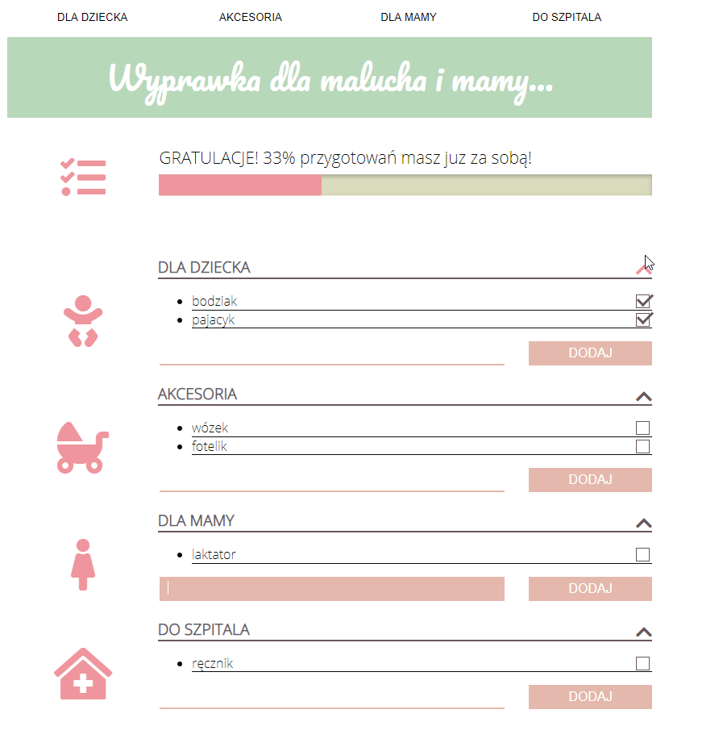

# ToDO List For Newborn
A to do list for future mom and dad. List is divided in sections: baby, accessories, mom, hospital. It shows the progress of your preparations with a progress bar.

## Table of contents
* [General info](#general-info)
* [Screenshots](#screenshots)
* [Technologies](#technologies)
* [Setup](#setup)
* [Features](#features)
* [Status](#status)
* [Inspiration](#inspiration)
* [Contact](#contact)

## General info
A to do list developed for my own use and practise using Local Storage as a data server. 

## Screenshots

## Technologies
* HTML5
* CSS
* JAVASCRIPT
* Written in Visual Studio Code

## Setup
Link to demo version: https://egwizdala.github.io/ToDoListForNewborn/

## Features
* Four categories
* Checkbox
* Status bar showing the progress

To-do list:
* Bug-fix
* Counter for each item
* Remove button
* Make a mobile app

## Status
Project is: _in progress_

## Contact
Created by Emilia Gwizdala [emilia.gwizdala@gmail.com](https://www.flynerd.pl/) - feel free to contact me!
